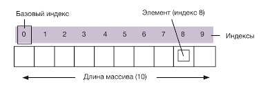

## Урок 1 - массивы

### Оглавнение

1. [Определение](#определение-массива)
2. [Задания](#задания)

## Определение массива

Массив – тип данных, в котором хранится упорядоченный набор «однотипных» элементов

В JS массив может состоять из разных типов, но это является плохой практикой

Физически массив - область памяти, имеющая ссылку на первый элементы (сама переменная), и длину (length).
Элементы идут строго друг за другом



### Виды массивов
```js
[1, 2, 5, 2, 6] // массив чисел

["Ель", "Сосна", "Береза"] // массив строк

[function() { return 1 }, function(el){return el}] // массив функций

[{ title: "Элемент 1" },  { title: "Элемент 2" }] // массив объектов
```

### Способы объявления массивов
```js
// стандартный способ
const list1 = []

// стандарный способ с инициализацией
const list2 = [1, 2, 100]

// способ через конструктор (Редкий)
const list3 = new Array(100)

// способ через объект Array (Экзотический)
const list4 = Array.from({ length: 100 })

```

### Операции с массивами
1. Объявление массива
2. Добавление / удаление элемента из массива
3. Редактирование элемента в массиве
4. Фильтрация
5. Сортировка
6. Создание нового массива на основе существующего
7. Прочее...

### Основные методы для работы с текущим массивом
* `push(element)` - добавление элемента в конец списка
* `pop()`  - удаление элемента с конца списока
* `length` - узнать длину

```js
const list = ["a", "b", "c"]
// ["a", "b", "c"]

list.push("d")
// ["a", "b", "c", "d"]

list.pop()
// ["a", "b", "c"]

list.length
// 3

list[2] = "f"
// ["a", "b", "f"] 

list[1]
// "b"
```

### Методы, которые создают новый массив
* `filter(function)` - создает массив, отфильтрованный по определенному признаку
* `map(function)`  - создает массив, преобразуя каждый элемент по определенному признаку
* `slice(start, end)` - создает массив, обрезав кусок от текущего

> function в `filter` должна возвращать `true` или `false`. 
> В противном случае она приведет возвращаемое значение к типу `boolean`
> 
> `Boolean(1) === true`
> `Boolean(0) === false`
> `Boolean(undefined) === false`

> function в `map` возвращает полученный новый элемент

```js
const list = [1, 2, 3, 4, 5]

const list1 = list.filter(function (element) {
    return element <= 3
})
// [1, 2, 3]

const list2 = list.map(function (element) {
    return element * 2
})
// [1, 4, 9, 16, 25]

const list3 = list.slice(1, 3)
// [2, 3, 4]
```


# Задания

**Задание 1** - заменить мышь ("Mouse") на свинку ("Pig") 
```js
const animals = ["Cat", "Mouse", "Dog"]

console.log(animals)
```

**Задание 2** - добавьте к ним Коровку ("Cow")
```js
const animals = ["Cat", "Mouse", "Dog"]

console.log(animals)
```

**Задание 3** - уберите из списока двух последних животных (поочередно)
```js
const animals = ["Cat", "Mouse", "Dog"]

console.log(animals)
```

**Задание 4** - получите массив только положительных чисел (через filter)
```js
const numbers = [8, 12, 4, 14, 36, 9, 18, 100, 0, -1]

console.log(numbers)
```

**Задание 5** - получите массив, в котором каждое число меньше на 2 (через map)
```js
const numbers = [8, 12, 4, 14, 36, 9, 18, 100, 0, -1]

console.log(numbers)
```

**Задание 6** - получите массив, в который соберуться элементы этого массива, начиная с 14, до 100
```js
const numbers = [8, 12, 4, 14, 36, 9, 18, 100, 0, -1]

console.log(numbers)
```

## Сложные задания

**Задание 7** - Получите массив на основе текущего, в котором каждое отрицательное число превратится в единицу, каждое положительное возведется в квадрат

```js
const numbers = [8, 12, 4, -14, 2, 9, -18, 10, -1]

console.log(numbers)
```

**Задание 8** - Получите массив, в котором соберутся только четные элементы

Подсказка - оператор `%` получает остаток от деления `(4 % 2 == 0)`

```js
const numbers = [8, 12, 4, -14, 2, 9, -18, 10, -1]

console.log(numbers)
```


